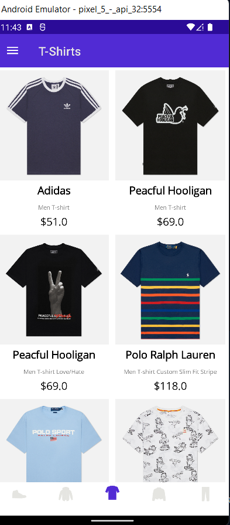
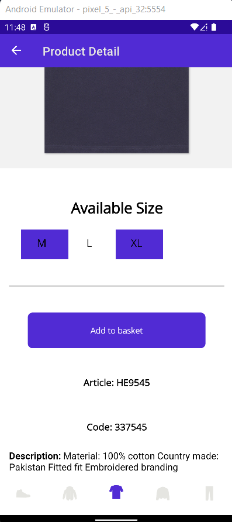
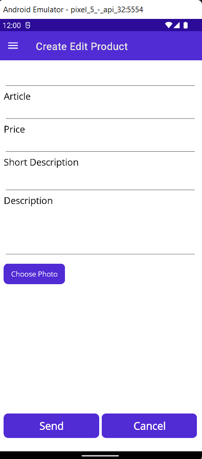
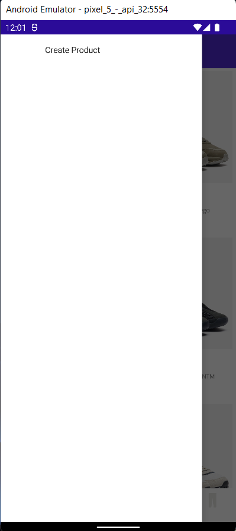
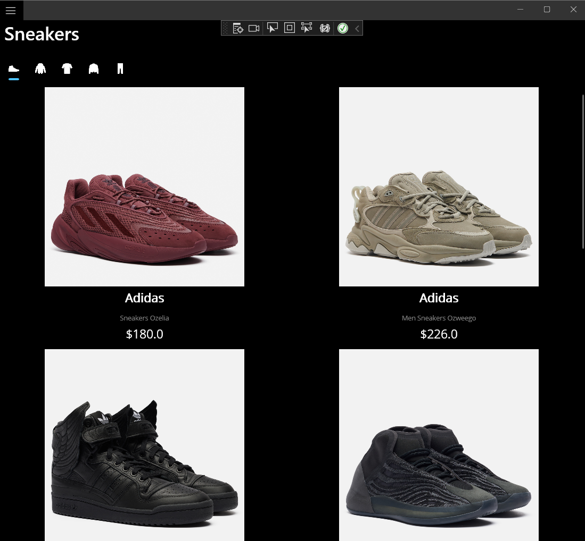
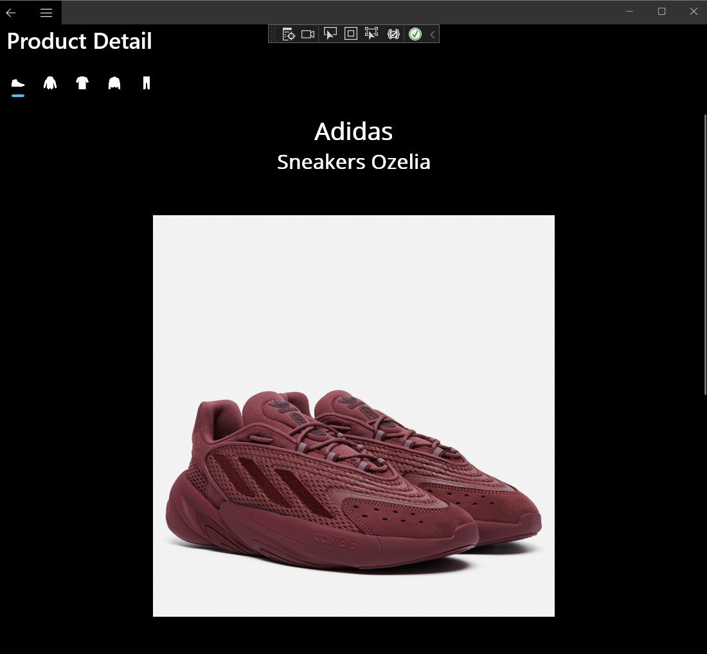
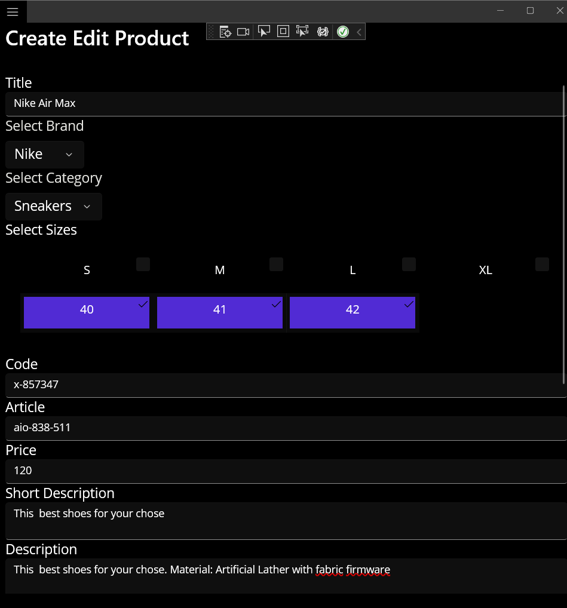
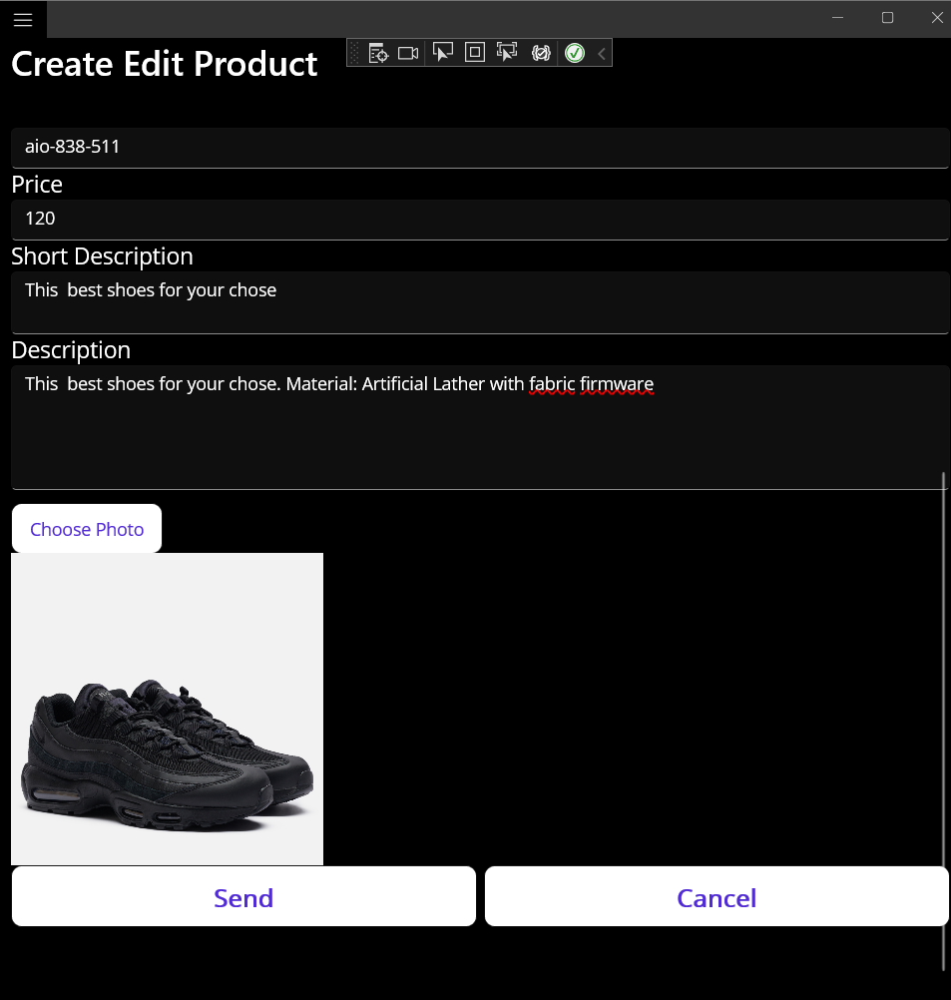
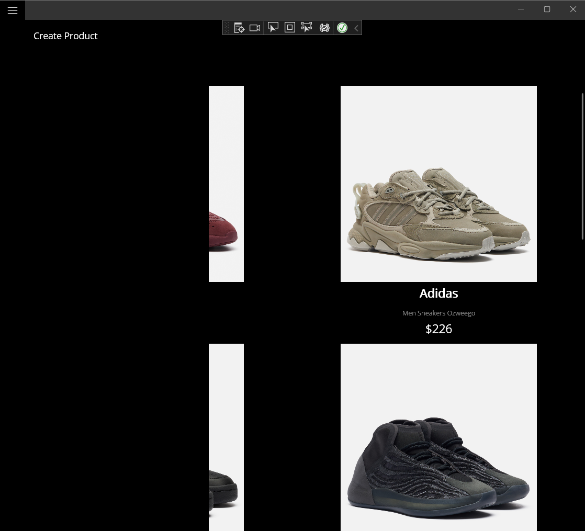

## This app based on .NET MAUI
#### Project name is TopShop for client side
This project created only UWP and Android platforms
## Screenshots from Android
#### Product List Page

#### Product Detail Page

#### Product Create Edit Page

#### Android flayout menu

## Screenshots from UWP
#### Product List Page

#### Product Detail Page

#### Product Create Edit Page

#### UWP flayout menu
